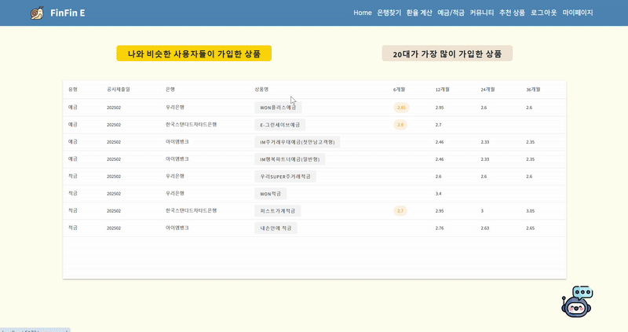

# 프로젝트 소개
SSAFY 12기 관통프로젝트 금융상품추천 웹 (우수상)
## 팀원 역할

| 팀원       | 역할                                                                         |
| ---------- | ---------------------------------------------------------------------------- |
| **정승국** | Front-end & Back-end 개발 (user, map, 예금/적금 API, 상품추천, UI/UX 디자인) |
| **전신빈** | Front-end & Back-end 개발 (exchange, article, Chatbot, UI/UX 디자인)         |

## 💻 Tech Stack

### **Language**

- **Python**
- **JavaScript**

### **Back-end**

- **Django**: 웹 애플리케이션 프레임워크
- **Django REST Framework**: API 개발을 위한 강력한 도구
- **dj-rest-auth**: 사용자 인증 및 관리
- **Pillow**: 이미지 처리 라이브러리

### **Front-end**

- **Vue 3**: 최신 Vue.js 프레임워크
- **Vuetify**: Vue.js를 위한 Material Design 컴포넌트 라이브러리
- **Pinia**: Vue.js 상태 관리 라이브러리
- **Axios**: HTTP 요청 라이브러리
- **Chart.js**: 데이터 시각화를 위한 JavaScript 라이브러리

## 프로젝트 개요

이 프로젝트는 **금융 관련 정보 제공 및 관리 웹 애플리케이션**으로, 사용자가 다양한 금융 상품을 조회하고 맞춤형 추천을 받을 수 있는 기능을 제공합니다. 실시간 환율 계산기, 게시판, 그리고 챗봇 기능을 통해 **사용자 경험**을 향상시키며, 위치 기반 서비스와 금융 상품 추천 알고리즘을 제공합니다.

## 주요 기능

- **사용자 관리**: 사용자 로그인, 회원가입, 장바구니 기능을 제공합니다.
- **예금/적금 상품**: 다양한 예금/적금 상품을 제공하고, 사용자가 관심 있는 상품을 추천합니다.
- **환율 계산기**: 실시간 환율 정보를 제공하여 사용자가 다른 통화로 환산할 수 있는 기능을 제공합니다.
- **지도**: 사용자가 특정 위치를 선택하면, 해당 위치 주변의 은행을 지도에서 확인할 수 있습니다.
- **게시판**: 사용자들이 금융 관련 정보와 의견을 자유롭게 공유할 수 있는 공간을 제공합니다.
- **챗봇**: 사용자의 질문을 자동으로 처리하며, 금융 상품에 대한 추천 및 정보 제공을 합니다.

## 금융 상품 추천 알고리즘

이 시스템은 두 가지 주요 알고리즘을 통해 사용자가 맞춤형 금융 상품을 추천받을 수 있도록 합니다:

### 1. **유사 금융 정보 기반 추천**

- 사용자가 회원가입 시 입력한 **연봉**, **자산**, **저축 성향**, **저축 희망 기간** 등을 기반으로, **유사한 금융 정보를 가진 사용자들**이 선택한 상품을 추천합니다.
- 추천 상품은 사용자의 금융 정보에 가장 적합한 상품 **10개**로 구성됩니다.

### 2. **내 나이대 인기 상품 추천**

- 사용자가 입력한 **나이**를 기준으로, 같은 나이대의 다른 사용자들이 가장 많이 선택한 **인기 상품** 10개를 추천합니다.
- 이 알고리즘은 사용자의 나이를 분석하여, **동년배**의 트렌드에 맞는 상품을 추천합니다.

# ERD

 (1).png>)

# 홈 화면

# 은행지도 검색

# 예금

# 적금

# 찜하기

# 마이페이지

# 맞춤 추천

# 커뮤니티

# 회원가입

# 챗봇(맞춤 추천)

## 회고
이 프로젝트는 제가 **금융 데이터를 실제 서비스에 접목한 첫 실전 경험**이자, 팀장을 맡아 기획부터 개발, 배포까지 **전 과정을 이끌며 성장한 계기**였습니다.

**1. 짧은 개발 기간 속 효율적 팀 운영**

- 프로젝트 기간은 단 10일로, 은행 위치 기반 서비스, 금융 상품 추천 알고리즘, 환율 계산기, 챗봇 등 구현 범위에 비해 상당히 타이트했습니다.
- 이에 따라 저는 **업무 우선순위 설정**과 **모듈 단위 병렬 작업 구조**를 도입하여 일정 지연 없이 마감할 수 있도록 조율했습니다.

**2. 사용자 중심 추천 시스템 설계 경험**

- 단순 조회에 그치지 않고, 사용자의 연봉, 자산, 저축 성향 등을 기반으로 한 **개인 맞춤 금융상품 추천 알고리즘**을 직접 설계 및 구현했습니다.
- 또한, 사용자의 나이대별 인기 상품을 분석하여 추천하는 알고리즘도 병행 구축하며 **데이터 기반 의사결정 능력**을 기를 수 있었습니다.
- 이 과정에서 실제 **공공 데이터 API**를 연동하고, 필터링/정제 과정을 거쳐 사용자에게 신뢰도 높은 정보를 제공하는 경험을 쌓았습니다.

**3. 챗봇과 지도 기능 도입을 통한 UX 강화**

- Vue 기반의 컴포넌트 구조를 효율적으로 설계하고, Vuetify와 Chart.js를 활용해 **직관적이고 반응형 UI**를 구현했습니다.
- 특히 사용자 경험 향상을 위해, **카카오 맵 API를 연동해 위치 기반 은행 검색 기능**과, 사용자의 금융 성향을 파악해 추천하는 **챗봇 인터페이스**를 구축한 것이 주요 차별점이었습니다.

**4. 성과와 회고**

- 프로젝트는 SSAFY 12기 관통 프로젝트에서 **우수상**을 수상하며 팀워크와 기획, 기술적 완성도를 인정받았습니다.
- 회고 과정에서는 기능 구현도 중요하지만, **데이터 정확도와 사용자 친화적 흐름 설계**가 서비스 품질에 결정적이라는 점을 체감했습니다.

